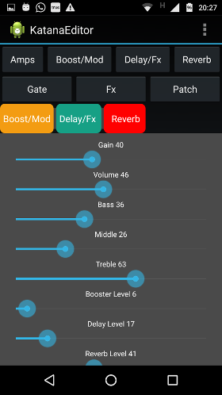
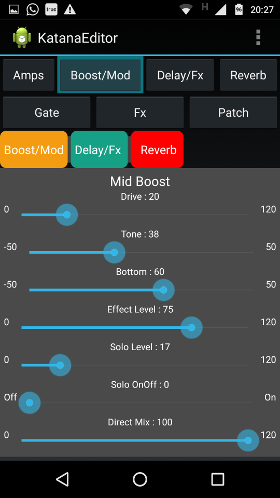
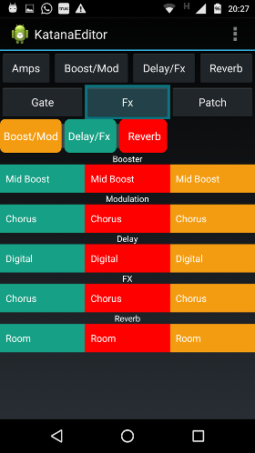

### Katana Editor for Android

By condor from VGuitarForums.

_This GitHub repository is currently just a mirror for his releases._

For the official releases and forum thread, see:
[VGuitarForums: KATANA- Condor's Katana AMP GUI Control (MIDI over USB) with Android](http://www.vguitarforums.com/smf/index.php?topic=20234.50)

**Installing**

Download the latest version from the release page:
https://github.com/katana-dev/android-katana-editor/releases

Extract the .apk file from the zip. Transfer this file to your Android and install it.
For example by using a file manager app.

wikiHow has a guide to help with this step. http://www.wikihow.tech/Manually-Install-Android-Apps

**Connecting**

You will need a USB On-The-Go (OTG) cable.
With that, connect your Android directly to the Katana's USB port.

Your phone will ask you, which app to open this USB device with.
Select KatanaEditor and give it any required permissions when asked.

At first all settings may show up incorrect. This is a known issue with the current version.
Try to move some knobs on your Katana as well as sliders on the app until the app syncs and accurately shows what your amp settings are.

**Screenshots**

  

**Sneaky amps**

Long press the Amp button to get a dropdown for all Sneaky Amps.

You should hear the effect right away when you pick a different amp.